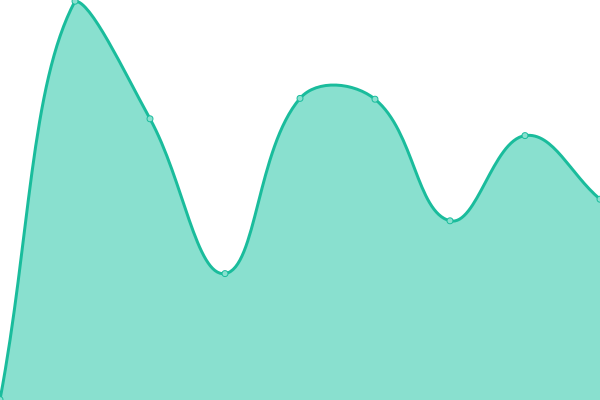

# [📈 Live Status](https://demo.upptime.js.org): <!--live status--> **🟩 All systems operational**

This repository contains the open-source uptime monitor and status page for [Upptime](https://upptime.js.org), powered by [Upptime](https://github.com/upptime/upptime).

With [Upptime](https://upptime.js.org), you can get your own unlimited and free uptime monitor and status page, powered entirely by a GitHub repository. We use [Issues](https://github.com/upptime/upptime/issues) as incident reports, [Actions](https://github.com/nevermined-io/upptime/actions) as uptime monitors, and [Pages](https://demo.upptime.js.org) for the status page.

<!--start: status pages-->
<!-- This summary is generated by Upptime (https://github.com/upptime/upptime) -->
<!-- Do not edit this manually, your changes will be overwritten -->
<!-- prettier-ignore -->
| URL | Status | History | Response Time | Uptime |
| --- | ------ | ------- | ------------- | ------ |
|  [Nevermined Website](https://nevermined.ai) | 🟩 Up | [nevermined-website.yml](https://github.com/nevermined-io/upptime/commits/HEAD/history/nevermined-website.yml) | 

 305ms
     
 | 

<a href="https://nevermined-io.github.io/upptime/history/nevermined-website">100.00%</a>
    

|  [Nevermined App](https://nevermined.app) | 🟩 Up | [nevermined-app.yml](https://github.com/nevermined-io/upptime/commits/HEAD/history/nevermined-app.yml) | 

 494ms
     
 | 

<a href="https://nevermined-io.github.io/upptime/history/nevermined-app">100.00%</a>
    

|  [Nevermined Docs](https://nevermined.ai/docs) | 🟩 Up | [nevermined-docs.yml](https://github.com/nevermined-io/upptime/commits/HEAD/history/nevermined-docs.yml) | 

 1095ms
     
 | 

<a href="https://nevermined-io.github.io/upptime/history/nevermined-docs">100.00%</a>
    

<!--end: status pages-->

[**Visit our status website →**](https://demo.upptime.js.org)

## 📄 License

- Powered by: [Upptime](https://github.com/upptime/upptime)
- Code: [MIT](./LICENSE) © [Anand Chowdhary](https://anandchowdhary.com), supported by [Pabio](https://pabio.com)
- Data in the `./history` directory: [Open Database License](https://opendatacommons.org/licenses/odbl/1-0/)
